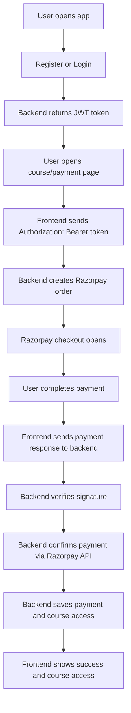

                                       Payment Gateway Integration

This workspace contains a full-stack payment and course-access demo built with **React + Vite** on the frontend and **Node.js + Express + MongoDB** on the backend. The payment provider used in the current implementation is **Razorpay**.

The app lets a user register, log in, start a payment, verify the payment on the server, and unlock course access after a successful transaction.

## What This Project Does

- Creates a Razorpay order from the backend
- Opens the Razorpay checkout on the frontend
- Verifies the payment signature on the backend
- Confirms the payment status from Razorpay itself
- Stores the payment in MongoDB
- Grants course access to the authenticated user
- Shows course content only when the user has access

## Tech Stack

### Frontend

- React 19
- Vite
- React Router
- Razorpay Checkout script loaded in `index.html`

### Backend

- Node.js
- Express
- MongoDB with Mongoose
- Razorpay SDK
- JWT authentication
- CORS
- dotenv

## Repository Structure

```text
README.md
backend/
  controller.js
  package.json
  server.js
  Controllers/
  Database/
    db.js
  middleware/
    authMiddleware.js
  routes/
    routes.js
  schemas/
    authSchema
    PaymentSchema
    userCourseSchema
    UserSchema
frontend/
  eslint.config.js
  index.html
  package.json
  README.md
  vite.config.js
  public/
  src/
    App.css
    App.jsx
    index.css
    main.jsx
    assets/
    components/
      course.jsx
      CourseAccess.jsx
      Failure.jsx
      InitPayment.jsx
      Login.jsx
      Payements.jsx
      PaymentButton.jsx
      PaymentModal.jsx
      Register.jsx
      Success.jsx
    pages/
```

## High-Level Flow



## Backend Flow

The backend entry point is [backend/server.js](backend/server.js).

### 1. Environment setup

The server loads environment values with `dotenv` and connects to MongoDB through [backend/Database/db.js](backend/Database/db.js).

Important environment variables:

- `MONGO_URL`
- `RAZORPAY_KEY_ID`
- `RAZORPAY_KEY_SECRET`
- `RAZORPAY_WEBHOOK_SECRET`
- `JWT_SECRET`
- `PORT`

### 2. Authentication routes

Login and register live in [backend/routes/routes.js](backend/routes/routes.js).

- `/auth/register` creates a new user and hashes the password
- `/auth/login` checks the password and returns a JWT token

The JWT token is stored by the frontend and sent in the `Authorization` header for protected routes.

### 3. Auth middleware

[backend/middleware/authMiddleware.js](backend/middleware/authMiddleware.js) verifies `Authorization: Bearer <token>`.

If the token is missing, invalid, or expired, the request is rejected.

### 4. Payment creation

`POST /create-order` in [backend/server.js](backend/server.js) does the following:

- Reads the authenticated user from the JWT middleware
- Accepts `amount` and `courseId`
- Creates a Razorpay order
- Stores user and course information in the Razorpay order notes

### 5. Payment verification

`POST /verify-payment` in [backend/server.js](backend/server.js) performs several checks:

- Verifies Razorpay signature
- Prevents duplicate processing with idempotency checks
- Fetches the payment from the Razorpay API
- Confirms the payment status is `captured`
- Fetches the order and validates amount/status
- Saves payment details in MongoDB
- Grants access in the `UserCourse` collection

### 6. Course access check

`GET /course` is protected by JWT middleware.

The backend checks whether the authenticated user has a matching entry in `UserCourse` for the requested course.

### 7. Payment history

`GET /payments` returns all payments and is also protected.

## Backend Data Models

### User

[backend/schemas/UserSchema](backend/schemas/UserSchema)

Stores:

- `fullName`
- `email`
- `password`
- `phoneNumber`
- `isPremium`
- `subscriptionExpiry`

### Payment

[backend/schemas/PaymentSchema](backend/schemas/PaymentSchema)

Stores:

- `orderId`
- `paymentId`
- `amount`
- `status`
- `userId`
- `userName`
- `userEmail`
- `razorpayDetails`

### UserCourse

[backend/schemas/userCourseSchema](backend/schemas/userCourseSchema)

Stores:

- `userId`
- `courseId`
- `paymentId`
- `orderId`
- `accessGrantedAt`
- `status`

This collection is what controls whether a user can open the course content.

## Frontend Flow

The frontend entry point is [frontend/src/main.jsx](frontend/src/main.jsx), which renders [frontend/src/App.jsx](frontend/src/App.jsx).

### Routing

Routes defined in [frontend/src/App.jsx](frontend/src/App.jsx):

- `/` -> `Login`
- `/login` -> `Login`
- `/register` -> `Register`
- `/init` -> `InitPayment`
- `/course` -> `Course`
- `/course-access` -> `CourseAccess`
- `/payments` -> `Payements`
- `/success` -> `Success`
- `/failure` -> `Failure`

### Login

[frontend/src/components/Login.jsx](frontend/src/components/Login.jsx)

- Sends credentials to `/auth/login`
- Stores the returned JWT token in `localStorage`
- Stores user details for UI display

### Initial payment page

[frontend/src/components/InitPayment.jsx](frontend/src/components/InitPayment.jsx)

- Loads logged-in user data from localStorage
- Sends `Authorization: Bearer <token>` to create a Razorpay order
- Opens Razorpay checkout
- Sends the Razorpay payment response back to the backend for verification

### Course purchase button

[frontend/src/components/PaymentButton.jsx](frontend/src/components/PaymentButton.jsx)

- Used on the course listing page
- Starts a payment for a selected course
- Sends `courseId` and `amount` to the backend
- Sends the token in the Authorization header

### Course listing

[frontend/src/components/course.jsx](frontend/src/components/course.jsx)

- Loads the logged-in user from localStorage
- Checks access for each sample course through the protected `/course` endpoint
- Shows `Access Course` if the user already owns the course
- Shows `Buy Now` if access is not yet granted
- Includes a `Refresh Access` button to recheck course access after payment

### Success / Failure screens

- [frontend/src/components/Success.jsx](frontend/src/components/Success.jsx) shows payment success and redirects to the course page
- [frontend/src/components/Failure.jsx](frontend/src/components/Failure.jsx) shows failure and allows retry

### Payment history

[frontend/src/components/Payements.jsx](frontend/src/components/Payements.jsx)

- Fetches payment history from `/payments`
- Uses JWT authentication

## Payment Lifecycle

1. User registers or logs in.
2. Backend returns a JWT token.
3. Frontend stores the token.
4. User selects a course and clicks buy.
5. Frontend calls `/create-order` with the token.
6. Backend creates a Razorpay order for that authenticated user.
7. Razorpay checkout opens in the browser.
8. User completes the payment.
9. Frontend sends the Razorpay response to `/verify-payment` with the token.
10. Backend verifies the signature and checks Razorpay directly.
11. Payment is stored in MongoDB.
12. Course access is granted in `UserCourse`.
13. Frontend rechecks access and displays the course button.

## Security Notes

- JWT is required for protected routes
- `userId` is no longer trusted from query params or request body
- Payment signature is verified server-side
- Payment status is confirmed with the Razorpay API
- Payment records are idempotent using unique `paymentId`

## How To Run Locally

### Backend

```bash
cd backend
npm install
npm start
```

### Frontend

```bash
cd frontend
npm install
npm run dev
```

## Required Environment Variables

### Backend `.env`

```env
PORT=5000
MONGO_URL=your_mongodb_connection_string
RAZORPAY_KEY_ID=your_razorpay_key_id
RAZORPAY_KEY_SECRET=your_razorpay_key_secret
RAZORPAY_WEBHOOK_SECRET=your_webhook_secret
JWT_SECRET=your_strong_jwt_secret
```

### Frontend `.env`

```env
VITE_RAZORPAY_KEY_ID=your_razorpay_key_id
```

## Testing Checklist

- Register a new user
- Log in and confirm a JWT token is saved
- Open the course page and confirm access checks work
- Start a payment and complete it in Razorpay test mode
- Confirm the success page appears
- Confirm the course access button changes after verification
- Confirm payment history shows the new payment

## Notes On Current Behavior

- The frontend stores auth data in localStorage
- Payment access is decided by the backend `UserCourse` collection
- The success page redirects automatically after payment
- Course access can be refreshed manually from the course page

## Known Gaps / Future Improvements

- Add refresh tokens for longer sessions
- Add rate limiting on auth and payment routes
- Add structured logging and monitoring
- Add webhook handling for asynchronous payment events
- Add automated tests for payment verification and access control

## Helpful Files

- [backend/server.js](backend/server.js)
- [backend/routes/routes.js](backend/routes/routes.js)
- [backend/middleware/authMiddleware.js](backend/middleware/authMiddleware.js)
- [backend/schemas/PaymentSchema](backend/schemas/PaymentSchema)
- [backend/schemas/userCourseSchema](backend/schemas/userCourseSchema)
- [frontend/src/App.jsx](frontend/src/App.jsx)
- [frontend/src/components/Login.jsx](frontend/src/components/Login.jsx)
- [frontend/src/components/InitPayment.jsx](frontend/src/components/InitPayment.jsx)
- [frontend/src/components/PaymentButton.jsx](frontend/src/components/PaymentButton.jsx)
- [frontend/src/components/course.jsx](frontend/src/components/course.jsx)
- [frontend/src/components/Success.jsx](frontend/src/components/Success.jsx)
